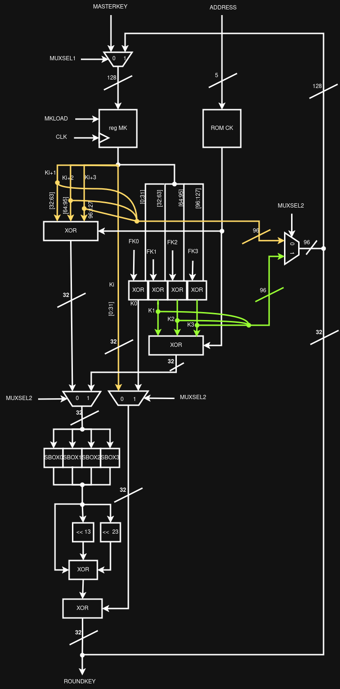
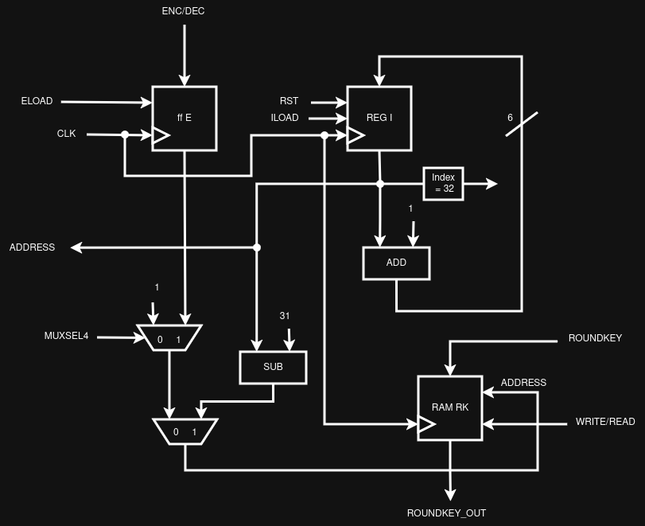
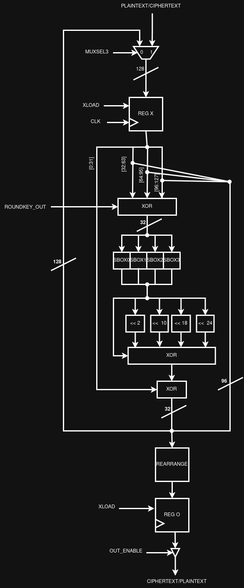
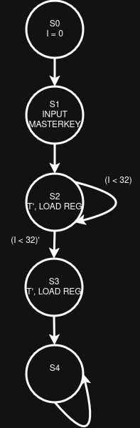
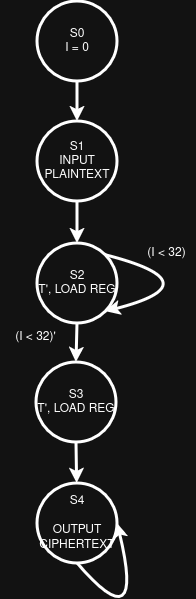
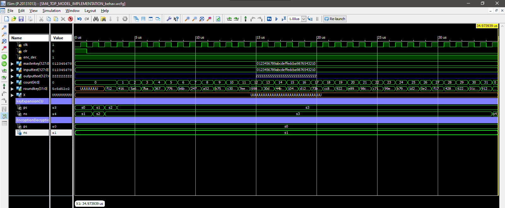
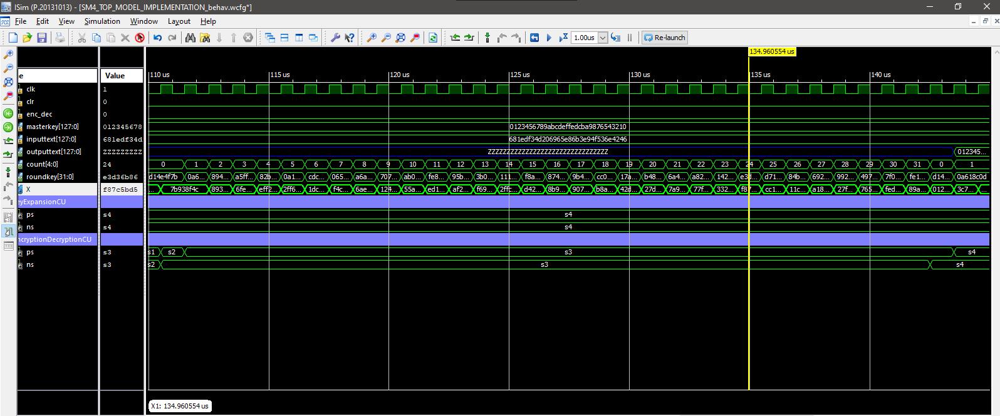

# SHANGMI(VERSION 4) OR SM4 CIPHER


## TABLE OF CONTENTS
- [Overview](#overview)
- [How it works](#how_it_works)
- [Screenshot](#screenshot)
- [Built with](#built_with)
- [Compilation instructions](#compilation_instruction)

## OVERVIEW
The SM4 cipher is a symmetric key cipher that works 32 rounds for either encryption or decryption, with the masterkey and plaintext being 128 bits long, The projects datapath is broken down into three main parts, the KeyGeneration unit, where 32 round keys needed for both encryption and decryption for each round function are generated, the CounterAndKeyStorage unit, that ensures we stay within 32 round functions and the values of the generated round keys are kept within a ram, then the EncryptionDecryption unit, where encryption of plaintext to ciphertext or vice versa takes place

There are also two control units, keyExpansionCU and EncryptionDecryptionCU for coordinating the actions of the keyExpansion unit and EncryptionDecryption unit


## HOW IT WORKS
The KeyExpansion unit is made of a linear transformation unit L, which performs the xor operations ``` 𝐶 = 𝐿(𝐵) = 𝐵 ⊕ (𝐵 <<< 13) ⊕ (𝐵 <<< 23). ``` and a non-linear transformation unit 𝜏, made of sboxes for substitution. The keyExpansion unit accepts a 128 bit masterkey MK,and produces 32 round keys which are stored in the CounterandKeyStorageUnit, to be later used by the EncryptionDecryption unit

The round keys are generated using the formulas


𝐾<sub>0</sub>, 𝐾<sub>1</sub>, 𝐾<sub>2</sub> , 𝐾<sub>3</sub> = (𝑀𝐾<sub>0</sub> ⊕ 𝐹𝐾<sub>0</sub>, 𝑀𝐾<sub>1</sub> ⊕ 𝐹𝐾<sub>1</sub>, 𝑀𝐾<sub>2</sub> ⊕ 𝐹𝐾<sub>2</sub>, 𝑀𝐾<sub>3</sub> ⊕ 𝐹𝐾<sub>3</sub>)

𝑟k<sub>i</sub>= 𝐾<sub>i+4</sub> = K<sub>i</sub> ⊕ T'(K<sub>i+1</sub> ⊕K<sub>i+2</sub> ⊕ k<sub>i+3</sub> ⊕ CK<sub>i</sub>), 𝑖 = 0,1, … ,31

where K<sub>i</sub>, FK<sub>i</sub> and CK<sub>i</sub> are constant parameters whereas MK<sub>i</sub> are the 4 32-bit partitions of the masterkey


EncryptionDecryption unit also have the linear transformation unit L which works as follows: ``` 𝐶 = 𝐿(𝐵) = 𝐵 ⊕ (𝐵 <<< 2) ⊕ (𝐵 <<< 10) ⊕ (B <<< 18)⊕ (B <<< 24). ```, and a non-linear transformation unit 𝜏, similar to the one in the KeyExpansion unit. It also accepts a Plaintext of ciphertext from the user, then generates results for every round. After the 32nd round, the results are rearranged and then outputted to the user  

## SCREENSHOTS
### DATAPATH'S, FSM'S AND SIMULATION RESULTS

- Key Generation DP


- Counter And Key Storage DP;


- Encryption / Decryption DP


- Key Generation FSM


- Encryption / Decryption FSM


### SIMULATION RESULTS
- Key Generation


- Encryption


- Decryption



### BUILT WITH
    - The whole project was implemented using VHDL and the xilinx ise


### COMPILATION INSTRUCTION


