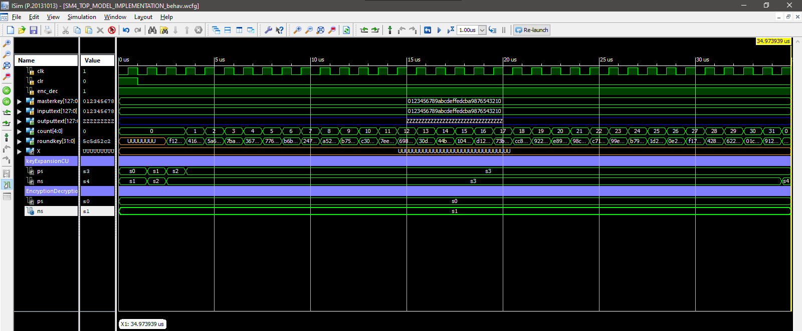
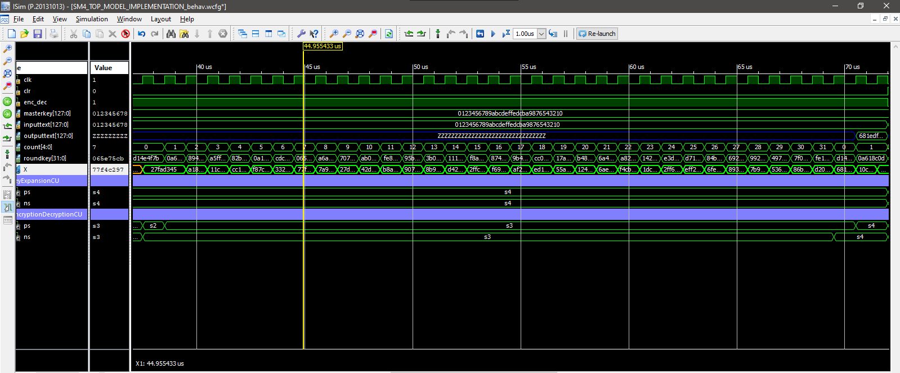
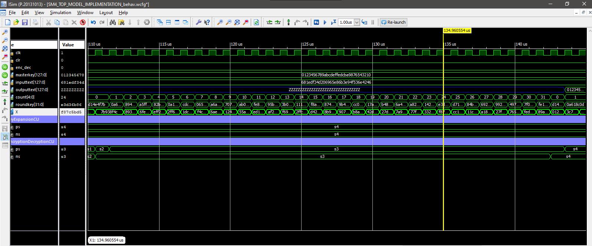

# SHANGMI(VERSION 4) OR SM4 CIPHER

## TABLE OF CONTENTS
- [Overview](#overview)
- [Screenshot](#screenshot)
- [My process](#process)
  - [Built with](#built_with)
  - [Compilation instructions](#compilation_instruction)

## OVERVIEW
The SM4 cipher is a symmetric key cipher with 32 round functions for either encryption or decryption, with the masterkey and plaintext being 128 bits long, The projects datapath is broken down into three main parts, the KeyExpansion unit, where 32 round keys needed for both encryption and decryption for each round function are generated, the CounterAndRam unit, that ensures we stay within 32 round functions and the values of the generated round keys are kept within this ram, then the EncryptionDecryption unit, where encryption of plaintext to ciphertext or vice versa takes place

There are also two control units, keyExpansionCU and EncryptionDecryptionCu for coordinating the actions of the keyExpansion unit and EncryptionDecryption unit

## SCREENSHOTS
- Key Generation;

- Encryption;

- Decryption;

## MY PROCESS
KeyExpansion unit, EncryptionDecryption unit are made of linear transformations(made of sboxes) that feeds into nonlinear transformations(achieved by manipulating the results using circular shifting), and the results from that being concatenated with other data to generate a new input

The whole project was implemented using VHDL and the xilinx ise
 

### BUILT WITH
    - The whole project was implemented using VHDL and the xilinx ise

### COMPILATION INSTRUCTION

